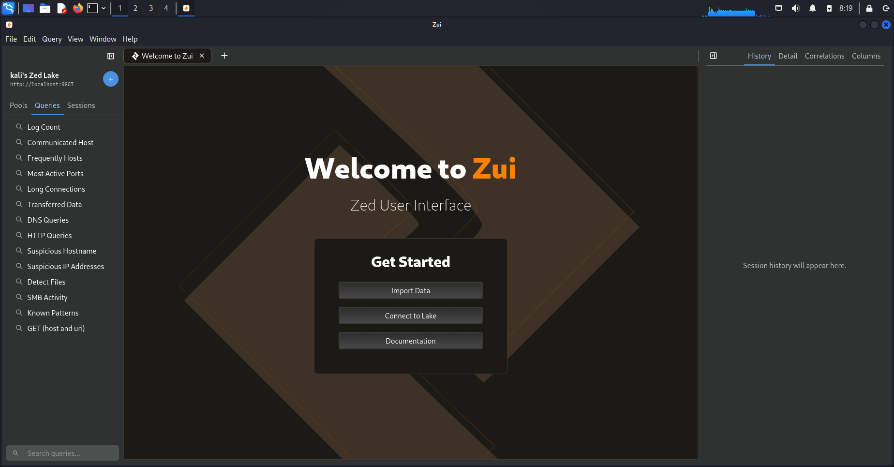
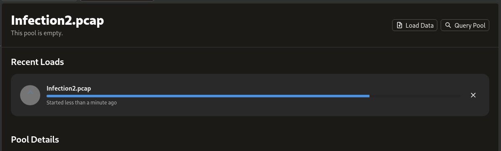
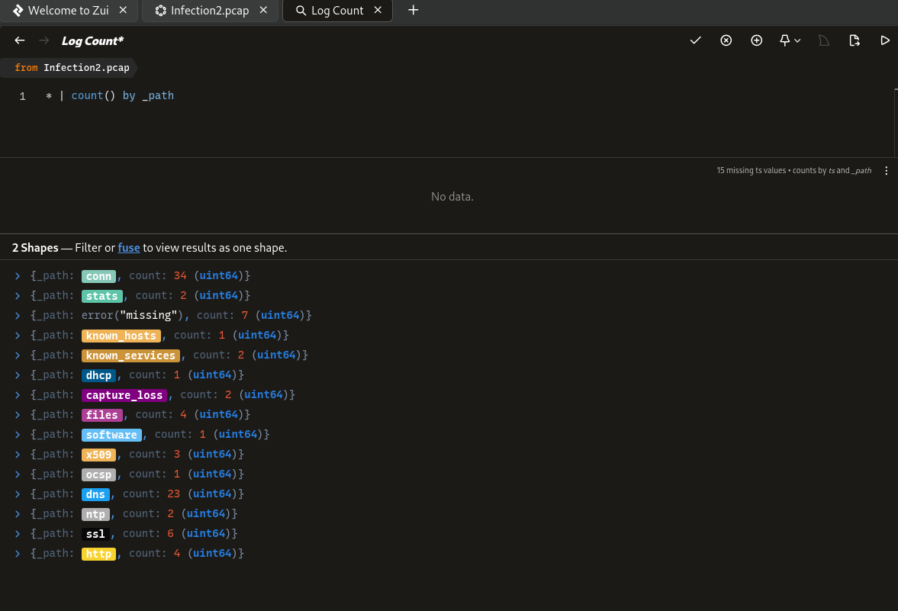
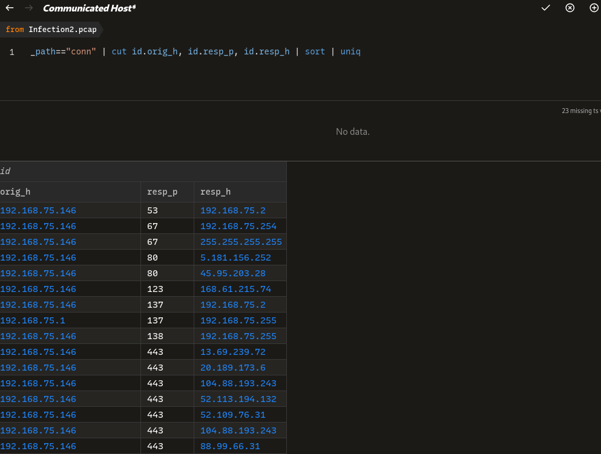
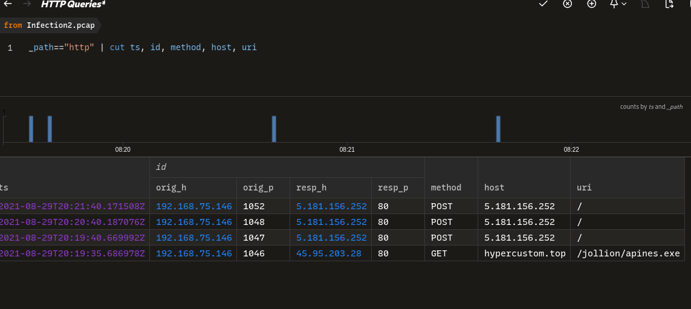
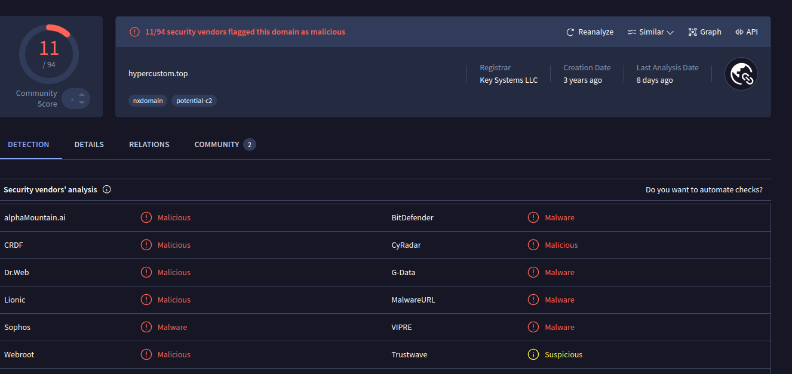
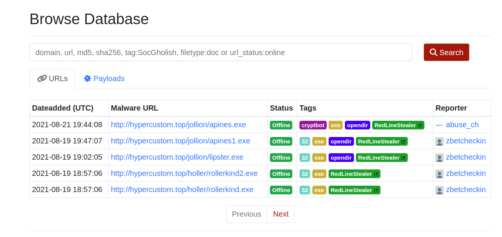
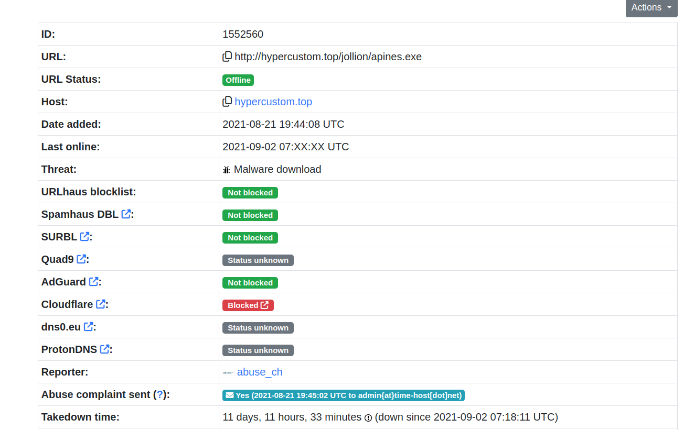

### [Home](../../index.md) | [Projects](../index.md)


# Zui 

Zui (formerly known as Brim) is a desktop app designed to simplify the investigation of PCAP files by leveraging the power of Zeek in an intuitive graphical interface. While Zeek alone is excellent for analyzing network traffic, working with large PCAP files can quickly become overwhelming. Zui makes this process much more accessible by providing a user-friendly GUI, making it easier to explore and interpret data. In this article, I’ll dive into investigating a PCAP file with Zui to showcase its capabilities and how it streamlines the analysis process.

## PCAP Analysis 

After opening Zui, we want to upload our PCAP for analysis. 
Here you want to click "Import Data".





Now it will start the upload process. The time it takes to upload will vary depending on the PCAP size. 





Once we have the file uploading we can start our investigation. Let's start with our first query. I want to see all of the logs that we generated. 
Our first query will look like this. 

```
* | count() by _path
```

Let's breakdown this query, before we see our results..

```
# * is a wildcard meaning it can be anything
```

```
# count() by _path will count the contents of each each path (log)
```



From the above picture we can see what logs were generated and how much information is inside them. 
If you wanted to see the contents of any of the paths you could run this. 

```
_path=="Name Of Log"
```

Let's continue our investigation. A good first step in our investigation would be to identify of what host were communicating. 
This will allow us to detect any abnormal or suspicious activity.

```
_path=="conn" | cut id.orig_h, id.resp_p, id.resp_h | sort | uniq
```



From this picture we can clearly see who was talking on the wire at the time of this PCAP and what port they were using. 
We are looking for anything that stands out. IP 192.168.75.146 is standing out to me. We can see it talking to a few different external IP's.
1. 5.181.156.252
2. 45.95.203.28
3. 168.61.215.74

Lets investigate further. The next thing I would like to do is to check the HTTP log. This log is very useful and can allow us to see if anything
was downloaded from these external host/websites. 

```
_path=="http" | cut ts, id, method, host, uri
```



If you look at the last entry on the table the Host 192.168.75.146 downloaded a .exe file named "apines.exe" from "hypercustom.top"(45.95.203.28)

I think we need to do some more research, on this domain. Let's see what [VIRUSTOTAL](https://www.virustotal.com/gui/home/upload) says about this url the .exe was downloaded from. 



We can see here that this domain has been marked as malicious I also want to check [URLhaus](https://urlhaus.abuse.ch/browse/) as well about this domain. 





From this 1st image we can see a tag as "Redline Stealer". Also from the 2nd image we can see the Threat category is labeled as "Malware Download"
A quick google search of "Redline Stealer" tells us that "This malware harvests information from browsers such as saved credentials, auto complete data, and credit card information. A system inventory is also taken when running on a target machine, to include details such as the username, location data, hardware configuration, and information regarding installed security software. More recent versions of RedLine added the ability to steal cryptocurrency."
This is something we would not want on one of our host let alone our Network. 


## Conclusion

In this investigation, we demonstrated how Zui simplifies PCAP analysis by providing an intuitive interface to query and visualize network traffic. From identifying communicating hosts to uncovering suspicious activity like malware downloads, Zui proves to be an invaluable tool for analysts dealing with large datasets. By integrating the power of Zeek and offering a streamlined GUI, Zui makes it easier to detect and respond to potential threats.

This example showcased a Redline Stealer infection, highlighting the risks malicious actors pose to network security. Whether you're a seasoned analyst or just starting in cybersecurity, Zui can help you uncover actionable insights faster and more effectively.

I encourage you to explore Zui and experiment with your own PCAP files. The more you use it, the more you'll uncover its potential for simplifying network investigations!


[Zui Documentation](https://zui.brimdata.io/docs)


[Zeek log Cheat Sheet](https://corelight.com/hubfs/resources/zeek-cheatsheets/corelight-cheatsheet-poster.pdf)


### Contact
Sean McGovern

La Grange, North Carolina 

[Linkedin](https://www.linkedin.com/in/sean-mcgovern-310457272/) 


