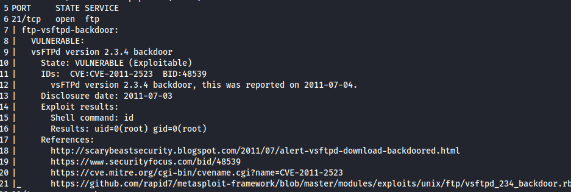

# Exploring NMAP

In a nutshell Nmap is a tool that allows for us to see devices and open ports on an network. It also allows us to see running services and detect vulnerabilities. Because Nmap is a such a powerful tool for IT Professionals, it is also a powerful tool for penetration testers and even hackers.

## Testing NMAP

Now for testing I will be using 2 virtual machines, a Kali-Linux machine and another Linux machine called Metasploitable 2. This VM is designed to be vulnerable so it will be perfect to test the power of Nmap. Now lets first check our IP sunbet of the Kali VM.

```
$ ifconfig
```


Alright we are on the 192.168.56.0/24 subnet.

Next lets scan for running host.

```
nmap -sP 192.168.56.*
```

*Please note the * is a wildcard character, so we are scanning the whole /24 subnet. 
This would of worked as well:

```
nmap -sP 192.168.56.0/24
```


Alright we see we have multiple running host. In this example I know the 192.168.56.104 in the metasploitable VM, lets dive deeper into that IP.

I want to see what Operating system is running first, so lets check that out.

```
nmap -O 192.168.56.104
```


We can see this machine is running a version of Linux and from the Trace route shown is only 1 hop away.

I wonder if there are any open ports on this machine… Lets check!

```
nmap -sS 192.168.56.104

nmap -sT 192.168.56.104
```


Wow, in the worlds of Phil Swift, “That’s a lot of open ports!” I do want to talk to you about the difference between nmap -sS and nmap sT. Both of the scans are using TCP to communicate with the host on that particular port to see if it’s open or not. The difference is the -sS (Stealth Scan) is not completing the 3 TCP 3 way handshake and -sT is completed the 3 way handshake. The full 3 way handshake of the client sending a “SYN”, then the host sending a “SYN, ACK”, then client again “ACK”. Let me show you with WireShark.


This image shows the full 3 way handshake between client and server.


This image is showing a incomplete TCP 3 way handshake.
Lastly lets check the house for vulnerabilities. There are scripts we can run to check for CVE’s against our target system.

```
nmap --script vuln -oN vuln_output.txt
```
(-oN is simply writting the output to a txt file for later use.)




I’m only showing 1 of the vulnerabilities that came up because there were so many of them! You name it this machines has vulnerability waiting to be exploited. Downgrade attacks, SQL injections, and Privilege escalation just to name a few.

As we can see, Nmap is a powerful tool that allows network administrators and security professionals to map their networks, identify open ports, and detect potential vulnerabilities before they become critical issues. Its versatility and efficiency make it an invaluable asset for proactive network management and security assessments. Whether you’re locating forgotten open ports or running vulnerability scans, Nmap provides the insight needed to maintain a secure and well-organized network.


### [Projects](./seanmcg93.io/projects/index.md)


### Contact
Sean McGovern

La Grange, North Carolina 

[Linkedin](https://www.linkedin.com/in/sean-mcgovern-310457272/) 


