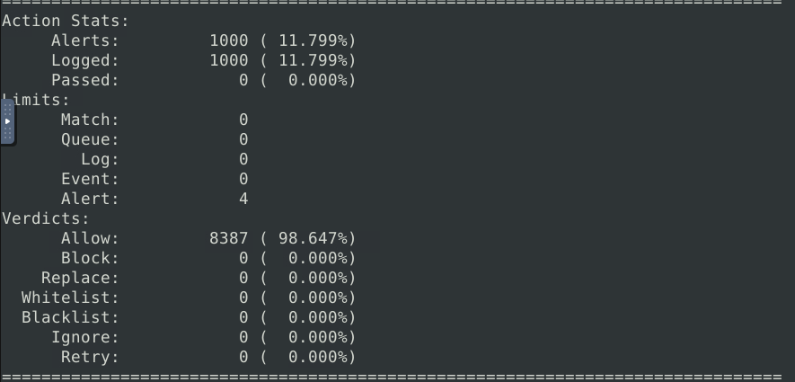

### [Home](../../index.md) | [Projects](../index.md)


# Snort


I have been using [TryHackMe](https://www.tryhackme.com) to further my knowledge in cybersecurity. Currently, I am working through the SOC Level 1 Path, which has introduced me to Snort.

According to [Snort.org](https://www.snort.org), _Snort is the foremost Open Source Intrusion Prevention System (IPS) in the world. Snort IPS uses a series of rules that help define malicious network activity and uses those rules to find packets that match against them and generates alerts for users.
Snort can be deployed inline to stop these packets, as well. Snort has three primary uses: As a packet sniffer like tcpdump, as a packet logger — which is useful for network traffic debugging, or it can be used as a full-blown network intrusion prevention system. Snort can be downloaded and configured for personal and business use alike._

The next step is my journal leads me to take on 2 separate scenarios to demonstrate what I have learned, with that being said lets dive into it. TIME TO FEED THE PIG!

## Scenario 1

For this first task we think we may be under a brute force attack. We need to use snort to investigate and if necessary take action to prevent this. First I’m going to run snort to see if I can quickly identify anything suspicious. To do this I will run the command:

```
sudo snort -X (The -X parameter will let us display the full packet details in HEX.) 
```

Now lets take a look at these packets and see if anything looks unusual. I think I may have found something..


This one was pretty easy to find because there is a lot of HEX displayed. Looks like someone is trying to use SSH and brute force into the system. Let’s create a rule to prevent this. We need to edit the local.rules file. That can be found in /etc/snort/rules/local.rules

We will run the command: 

```
sudo gedit /etc/snort/rules/local.rules (gedit is a text tool similar to nano)
```

Here we can create a rule to block the activity. The rules I’m creating is going to reject any packets with a 10.10.245.36 address going to any IP using port 22.


Now we can test that our rules are being recognized by snort and there is no syntax errors by running: 

```
sudo snort -T -c /etc/snort/snort.conf (-T is a self test and -c is identifying the configuration file, the path of snort.conf)
```

If it validates we should be good to run snort again with this new rule to see if it stops the suspicious traffic and logs it for us to see!

We can now run snort with the newly created rule by running:

```
sudo snort -c /etc/snort/snort.conf -A full (-A tells snort which alert mode to use, I use -A full. Which is full alert mode it provides all possible information regarding the alert.)
```



Under action stats “Alerts” is how many times a rule/s were triggered. It looks like we stopped it. I also want to check the logs as well.

```
Sudo gedit /var/log/snort/alert
```


Our rule worked well! Here you can see the generated message that was included in the rule, the date, time and other details of the packet. We can see the generated message for each time the rule it self was triggered. Now lets see what scenario 2 has in store for us.

## SCENARIO 2

For this next scenario we need to stop a reverse shell attempt. Our plan of attack, or should I say plan of defense should be very similar to scenario 1.

First we investigate the current network activity.

```
Sudo snort -X
```


Well we don’t have a lot of HEX like in this last one to give it away, but something I do see as odd is Port 4444. Port 4444 is used by Metasploit to create back doors into a system. Now with us knowing this lets go ahead and create a rule for this :

```
sudo gedit /etc/snort/rules/local.rules
```

I want to create 2 rules here, one for the suspicious IP and one for the port it self.

The rules will look like this:

```
reject tcp any any <> 10.10.144.156 any (msg:”SUSPICIOUS IP POSSIBLE BACK DOOR”; sid:1000001; rev:1;)
```
```
reject tcp any any <> any 4444 any (msg:”SUSPICIOUS PORT METASPLOIT”; sid:1000002; rev:2;)
```

Next we validate the newly created rules:

```
sudo snort -T -c /etc/snort/snort.conf
```

Alright great! The rule has been validated lets put it to the test!

```
Sudo Snort -c /etc/snort/snort.conf -A full
```


It looks like we prevented the back door!

Let’s check out the logs as well:

```
gedit /var/log/snort/alert
```


Through these two scenarios, I’ve gained a deeper appreciation for the power and flexibility of Snort. From detecting a brute force attack to stopping a reverse shell attempt, Snort has proven to be a critical tool in a cybersecurity analyst’s arsenal. By leveraging its ability to create custom rules, analyze network traffic, and respond to threats, I can see how Snort can play a pivotal role in safeguarding networks from malicious activity.

This journey has shown me not only how to use Snort effectively but also how to think like an attacker, which is essential for proactive defense. While these scenarios were controlled exercises, the skills I’ve learned can be applied to real-world environments to identify and mitigate threats.

If you’re interested in learning more about Snort, I encourage you to try it out yourself. Experiment with creating your own rules, analyzing traffic, and responding to simulated threats. You’ll find that Snort is both a powerful tool and an excellent learning platform.

As I continue my cybersecurity journey, I’m excited to explore more advanced features of Snort and other tools that help protect systems and networks. Stay tuned for more as I share my progress, and feel free to reach out or share your own experiences with Snort—I’d love to hear from you!

Happy learning, and remember: Keep feeding the pig!


### Contact
Sean McGovern

La Grange, North Carolina 

[Linkedin](https://www.linkedin.com/in/sean-mcgovern-310457272/) 
